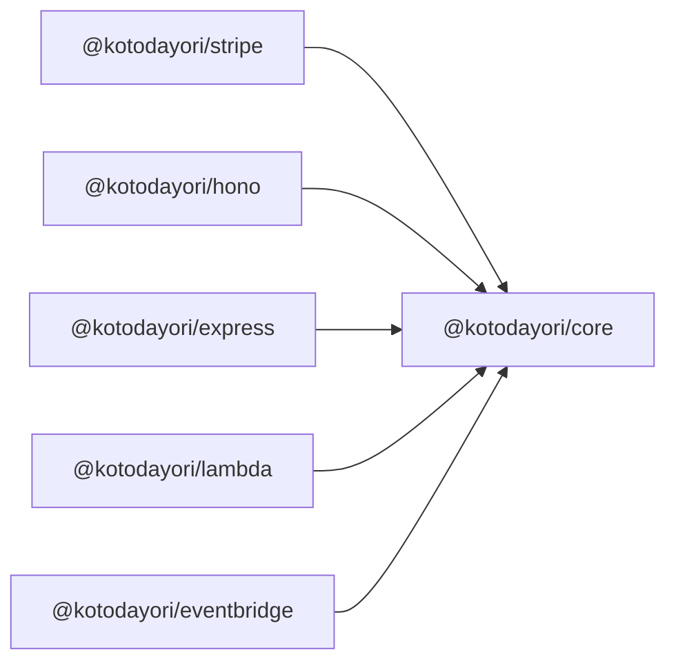

Kotodayori は、TypeScript 向けの Hono ライクな型安全 Webhook ルーティングライブラリです。当初は Stripe Webhook 向けに作られましたが、あらゆるイベントソースに対応したフレームワーク非依存の Webhook 処理ソリューションへと進化しています。

## 主な特徴

- **型安全な Webhook ルーティング** — ジェネリクスを使った完全な TypeScript サポート
- **フレームワーク非依存のコア** — コアのルーティングロジックはフレームワーク依存ゼロ
- **Stripe を第一級サポート** — 351 種類以上の Stripe イベントタイプに完全な型推論
- **モノレポ構成** — コア・アダプター・ツール群を複数パッケージで提供
- **Node.js >= 18** — モダンなランタイムサポート

## アーキテクチャ

Kotodayori は**アダプターパターン**に従っています。コアパッケージ（`@kotodayori/core`）にすべてのルーティングロジックが含まれており、フレームワーク依存はゼロです。フレームワーク固有のパッケージ（Hono・Express・Lambda・EventBridge）がコアをラップし、各環境向けに公開します。

## 設計原則

1. **型安全を最優先** — すべてのイベントはジェネリクスで完全に型付け
2. **フレームワーク非依存のコア** — コアはフレームワーク依存ゼロ
3. **アダプターパターン** — フレームワーク連携はコアをラップする形で実装
4. **チェーン可能な API** — ハンドラー登録のための Hono ライクな流暢なインターフェース
5. **プラグイン可能な検証** — あらゆる Webhook プロバイダーに対応した独自 Verifier の利用が可能
6. **ランタイムバリデーション** — Zod とのオプション連携でスキーマ検証が可能

## 次のステップ

- [クイックスタート](/ja/getting-started/quick-start/) — `create-kotodayori` で新規プロジェクトを生成
- [既存アプリへの追加](/ja/getting-started/add-to-existing-app/) — お持ちのアプリに Kotodayori を組み込む
- [Stripe Webhooks](/ja/guides/stripe-webhooks/) — 型安全な Stripe Webhook のセットアップ
- [カスタム Webhook](/ja/guides/custom-webhooks/) — Kotodayori をあらゆる Webhook プロバイダーで使用
